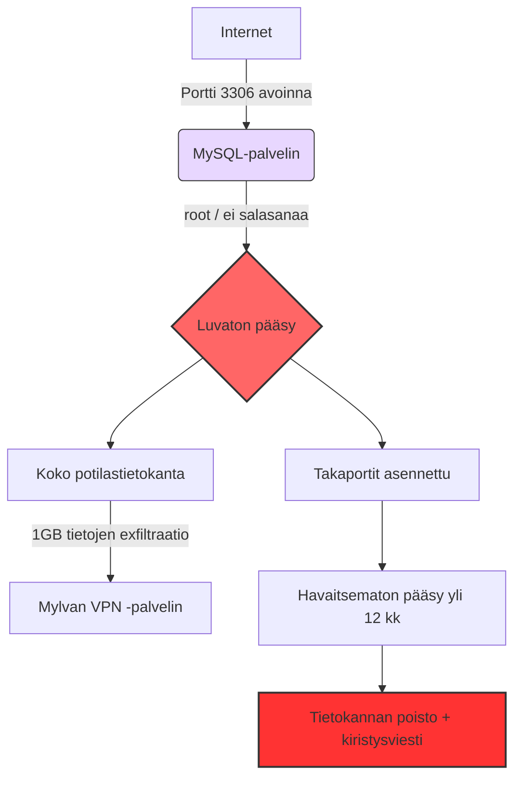

# Vastaamo-tietomurto: Incident Post-Mortem -raportti  
### Tekninen tapausanalyysi — Satu Ikola

**🌐 Kieliversiot:**
🇫🇮 Suomi | 🇬🇧 [English](README.md)

---

### Aiheita:  
MySQL · Incident Response · Blue Team · SOC · Microsoft Sentinel · Microsoft Defender XDR · MITRE ATT&CK · Data Exfiltration · Threat Hunting · GDPR · Ransomware · Cybersecurity Governance

---

## 📘 Sisällysluettelo

- [1. Yhteenveto](#1-yhteenveto)
- [2. Tapahtumien aikajana](#2-tapahtumien-aikajana)
- [3. Juurisyyanalyysi – Root Cause Analysis (RCA)](#3-juurisyyanalyysi--root-cause-analysis-rca)
- [4. MITRE ATT&CK -kartoitus](#4-mitre-attck-kartoitus)
- [5. Hyökkäyspolun kaavio](#5-hyökkäyspolun-kaavio)
- [6. Missä puolustus petti](#6-missä-puolustus-petti)
- [7. Suositellut tekniset kontrollit](#7-suositellut-tekniset-kontrollit)
- [8. Opit SOC- ja Blue Team -näkökulmasta](#8-opit-soc--ja-blue-team--näkökulmasta)
- [9. Liiketoimintavaikutukset](#9-liiketoimintavaikutukset)
- [10. Yhteystiedot](#10-yhteystiedot)

---

## 1. Yhteenveto

Vastaamon tietomurto vuosina 2017–2020 on yksi Suomen vakavimmista kyberrikoksista.  
Unohdettu ja julkisesti auki ollut tietokantaportti, salasanaton root-käyttäjä, puutteellinen valvonta ja salaamattomat terapiamerkinnät mahdollistivat sen, että hyökkääjä pystyi viemään ja myöhemmin vuotamaan **33 000 potilaan** erittäin arkaluonteiset tiedot.

Seurauksina olivat muun muassa:

- Yrityksen **konkurssi vuonna 2021**
- Toimitusjohtajan tuomio tietosuojarikoksesta
- Yli **20 000 rikosilmoitusta** asiakkailta
- Hyökkääjälle **6 vuoden 3 kuukauden** vankeustuomio vuonna 2024

Tässä raportissa tarkastelen tapausta SOC ja Blue Team -näkökulmasta, kytken tapahtumat MITRE ATT&CK -viitekehykseen ja nostan esiin sekä puolustuksen epäonnistumiset että konkreettiset opit.

---

## 2. Tapahtumien aikajana

### 2017-11: Portti 3306 avataan
MySQL-tietokannan portti 3306 avataan huoltotoimia varten ja jätetään julkisesti auki noin **16 kuukauden** ajaksi.

### 2017-12: Ensimmäinen luvatoin kirjautuminen
Hyökkääjä saa pääsyn järjestelmään käyttäen heikkoja tunnuksia:
- `käyttäjätunnus: vastaamo`
- `salasana: zuukka66`
- `root`-käyttäjällä ei ole salasanaa

### 2018-11: 1 GB potilastietoja viedään
Noin gigatavu potilastietoa siirretään ulkopuoliselle VPN-palvelimelle.  
Puuttuvan lokituksen ja valvonnan vuoksi tapahtuma ei herätä hälytyksiä.

### 2019-03-13: Portti suljetaan
Portin aukiolo huomataan ja se suljetaan 16 kuukauden jälkeen.

### 2019-03-15: Kiristys ja tietokannan tuhoaminen
Kaksi päivää myöhemmin potilastietokanta tuhotaan ja tilalle jätetään kiristysviesti, jossa vaaditaan lunnaita kryptovaluuttana.

### 2020-09–10: Kiristysviestit ja tietojen vuotaminen
- Johto ja it-henkilöstö saavat uudet kiristysviestit  
- Koko potilastietokanta julkaistaan pimeässä verkossa  
- Yksittäisiä asiakkaita kiristetään suoraan

### 2023–2024: Pidätys ja tuomio
Hyökkääjä pidätetään vuonna 2023 ja tuomitaan vuonna 2024 6 vuoden 3 kuukauden vankeuteen.

---

## 3. Juurisyyanalyysi – Root Cause Analysis (RCA)

### Konfiguraatiovirheet (Security Misconfiguration)
- MySQL-portti 3306 oli julkisesti avoinna
- Palomuuri ei rajoittanut liikennettä riittävästi
- `root`-käyttäjällä ei ollut salasanaa

### Heikko pääsynhallinta (Weak Access Control)
- Heikot ja helposti arvattavat salasanat
- Ei monivaiheista tunnistautumista (MFA)
- Puutteellinen pääkäyttäjätunnusten hallinta

### Puutteellinen lokitus ja valvonta (Lack of Logging and Monitoring)
- 1 GB tietojen exfiltraatio jäi kokonaan havaitsematta
- Ei SIEM-järjestelmää tai tapahtumien korrelaatiota
- Ei outbound-liikenteen poikkeamien seurantaa
- Ei hälytyksiä poikkeavasta tietokantatoiminnasta

### Salaamattomat arkaluonteiset tiedot (Unencrypted Sensitive Data)
- Terapiamerkinnät ja henkilötiedot tallennettu selkokielisinä
- Suora GDPR-vaatimusten rikkominen

### Hallintamallien puutteet (Governance Failures)
- Tietoturvalla ei ollut selkeää omistajaa tai vastuuhenkilöä
- Muutostenhallinta puuttui (portti avattiin ja unohdettiin sulkea)
- Incident response -suunnitelmaa ei ollut
- Riskienhallinta ei vastannut käsiteltävän datan kriittisyyttä

---

## 4. MITRE ATT&CK -kartoitus

| Hyökkäysvaihe        | Tekniikka ID | Tekniikan nimi                           |
|----------------------|--------------|-------------------------------------------|
| Alkupääsy            | T1190        | Julkisen sovelluksen hyväksikäyttö        |
| Tunnusten murto      | T1110        | Salasanojen arvailu / Brute Force         |
| Oikeuksien laajennus | T1068        | Haavoittuvuuden hyödyntäminen             |
| Puolustuksen väistö  | T1070        | Lokien poisto / Lokituksen puute          |
| Tiedonkeruu          | T1005        | Tiedot paikallisesta järjestelmästä       |
| Tietojen exfiltraatio| T1041        | Exfiltraatio C2-kanavan kautta            |
| Vaikutus             | T1486        | Tietojen salaus / tuhoaminen              |

---

## 5. Hyökkäyspolun kaavio

## 6. Missä puolustus petti

### **1. Ei SIEM-järjestelmää tai riittävää valvontaa**
- Ei outbound-liikenteen poikkeamahavaintoja  
- Ei massalatausten tunnistusta  
- Ei tapahtumien korrelaatiota  
- Ei pitkäkestoisen tunkeutumisen havaitsemista

### **2. Ei salausta**
Terapiamerkinnät ja henkilötiedot olivat selkokielisinä → suora GDPR-rikkomus ja erittäin korkea yksityisyyden riski.

### **3. Identiteetin- ja pääsynhallinnan ongelmat**
- Root-käyttäjällä ei ollut salasanaa  
- Heikot ja staattiset salasanat  
- Monivaiheinen tunnistautuminen (MFA) puuttui kokonaan

### **4. Riskienhallinnan puute**
Kriittinen tuotantotietokanta oli avoinna internetiin yli vuoden ilman, että asia havaittiin tai sille tehtiin mitään.

### **5. Muutostenhallinnan puute**
Portti avattiin huoltotöitä varten, mutta unohdettiin sulkea.  
Ei dokumentointia, ei vastuuhenkilöä, ei tarkistuksia.

---

## 7. Suositellut tekniset kontrollit

- Sulje kaikki tarpeettomat portit; tietokantoja ei koskaan tule altistaa suoraan internetiin  
- Ota käyttöön vahvat salasanapolitiikat sekä MFA  
- Salaa kaikki arkaluontoinen data (levossa ja liikenteessä)  
- Käytä SIEM-järjestelmää (esim. Microsoft Sentinel), jolla:  
  - tunnistetaan poikkeavat SQL-kyselyt  
  - valvotaan ulospäin suuntautuvan liikenteen määriä  
  - havaitaan impossible travel -tyyppisiä kirjautumisia  
- Segmentoi verkko ja rajoita pääsyä vain niille käyttäjille, jotka sitä todella tarvitsevat  
- Noudata least privilege -periaatetta järjestelmien ja tunnusten oikeuksissa

---

## 8. Opit SOC- ja Blue Team -näkökulmasta

### **Microsoft Sentinel olisi voinut havaita:**
- Massiiviset tietomäärien exfiltraatiot  
- Poikkeavat SQL-kyselykuviot  
- Ulkomailta tai epätyypillisistä verkoista tulleet kirjautumiset  
- Lateraalisen liikkeen sekä pysyvyyden merkit

### **Defender XDR olisi voinut nostaa esiin:**
- Salasanattomat admin-tilit  
- Epäilyttävät prosessit, backdoor-ohjelmat  
- Signaalien korrelaation verkon, identiteetin ja päätelaitteiden välillä

> **Keskeinen oppi:**  
> Suurin osa vakavista tietomurroista voidaan estää peruskontrollien (kovennus, seuranta, pääsynhallinta) avulla.  
> Kyse ei ole monimutkaisista ratkaisuista — vaan siitä, että perusasiat tehdään hyvin.

---

## 9. Liiketoimintavaikutukset

- **Konkurssi vuonna 2021**  
- **Toimitusjohtajan tuomio vuonna 2023**  
- **608 000 € GDPR-sakko**  
- Pitkäkestoinen luottamuksen menetys  
- Yli 33 000 potilasta altistui yksityisyyden ja identiteettivarkauksien riskille  
- Aiheutti valtakunnallisen keskustelun tietoturvan tasosta sosiaali- ja terveyspalveluissa

---

## 10. Ajankohtaista Vastaamo-tapauksesta (2025–2026)

Tämä osio kokoaa yhteen tilanteen, joka koskee Vastaamo-tietomurtoa vuosien 2025–2026 vaihteessa, sisältäen uudet käänteet, oikeusprosessien etenemisen, korvausjärjestelyt sekä avoimet tutkimuslinjat.

Tämä osio kokoaa yhteen Vastaamo-tapauksen ajankohtaisimmat käänteet vuosien 2025–2026 vaihteessa. Mukana ovat oikeusprosessin eteneminen, uudet syytteet, uhrien korvaukset ja avoimet tutkimuslinjat.

---

### 🔎 Keskeiset uudet tapahtumat

| Aihe | Kuvaus |
|------|--------|
| **Uusi syytetty: Patrick Newhard (USA)** | Yhdysvaltalainen Patrick Newhard on syytettynä Vastaamo-tapaukseen liittyvien kiristysviestien lähettämisestä. Häntä ei epäillä itse tietomurrosta vaan kiristyksestä. Hänet luovutettiin Virosta Yhdysvaltoihin. |
| **Kivimäki vapautettu vangitsemisesta (syksy 2025)** | Aleksanteri Kivimäki vapautettiin tutkintavankeudesta syyskuussa 2025. Käräjäoikeuden tuomio (6 v 3 kk) on edelleen voimassa, mutta hän odottaa hovioikeuden päätöstä vapaalla. |
| **Hovioikeuden käsittely päättyi syksyllä 2025, tuomio helmikuussa 2026** | Helsingin hovioikeuden pääkäsittely käytiin 19.8.–26.11.2025. Lopullinen tuomio annetaan **28.2.2026 mennessä**, ei syksyllä 2025. |
| **Uhrien korvausprosessi** | Valtiokonttori maksaa korvauksia. Osa uhreista ja asianajotoimistoista pitää korvauksia riittämättöminä. |
| **Mahdollinen laajempi rikosverkosto** | Newhardin tapaus viittaa siihen, että kiristyksen takana on voinut olla useampia henkilöitä. Tutkinta jatkuu. |
| **Vastaamon GDPR-sakko pysyy voimassa** | 608 000 € sakko jäi voimaan perustuen puutteelliseen lokitukseen, heikkoon suojaamiseen ja tietosuojavelvoitteiden laiminlyöntiin. |

---

### 🧭 Tilanne koosteena (mikä on päätetty – mikä kesken)

#### ✔ Päätettyä
- Käräjäoikeuden tuomio Kivimäelle: **6 vuotta 3 kuukautta vankeutta**  
- **608 000 € GDPR-sakko**  
- Laaja potilastietojen vuoto vahvistettu  
- Tapaus arvioidaan edelleen Suomen vakavimmaksi yksityisyydensuojaan kohdistuneeksi rikokseksi  

#### ⏳ Kesken / Avoinna
- **Hovioikeuden lopullinen tuomio: 28.2.2026 mennessä**  
- Mahdolliset lisäsyytteet ja avunantajien roolit  
- Korvausten arviointi ja laajuus  
- Kansainvälisten toimijoiden osuus  

---

### 🌐 Lähteet

- Bitdefender — *US citizen charged in Vastaamo extortion case*  
  https://www.bitdefender.com/en-us/blog/hotforsecurity/vastaamo-psychotherapy-hack-us-citizen-charged-in-latest-twist-of-notorious-data-breach

- Databreaches.net — *Kivimäki walks free during appeal*  
  https://databreaches.net/2025/09/11/kivimaki-walks-free-during-appeal-over-vastaamo-data-breach

- Helsingin hovioikeus — *Tuomio 28.2.2026 mennessä*  
  https://tuomioistuimet.fi/hovioikeudet/helsinginhovioikeus/fi/index/tiedotteet/2025/paakasittelyvastaamo-asiassaalkaaelokuussa2025r241302.html

- Valtiokonttori — *Vastaamo-korvaukset*  
  https://www.valtiokonttori.fi/en/services/services-related-to-compensation-and-accidents/vastaamo

- EDPB — *Administrative fine imposed on Vastaamo*  
  https://www.edpb.europa.eu/news/national-news/2022/administrative-fine-imposed-psychotherapy-centre-vastaamo-data-protection_en

- Have I Been Pwned — *Leak details*  
  https://haveibeenpwned.com/Breach/Vastaamo

---

### 📌 Yhteenveto

Vastaamo-tapaus on edelleen kesken oleva rikos- ja tietoturvatapaus.  
**Helmikuun 2026 hovioikeuden päätös** määrittää lopullisesti juridisen vastuun.  
Samalla korvausprosessit, uudet epäillyt ja kansainvälinen tutkinta pitävät tapauksen voimakkaasti esillä kyberturvallisuus- ja oikeuspiireissä.

---

## 11. Yhteystiedot

**Satu Ikola**  
GitHub: https://github.com/SatuIkola  
LinkedIn: https://www.linkedin.com/in/satu-ikola
