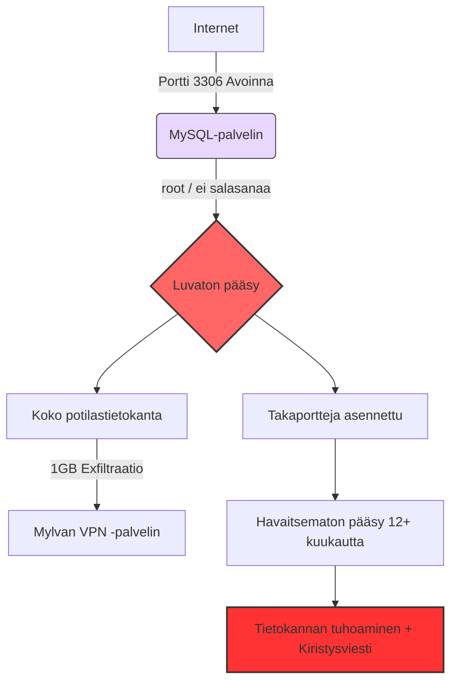

# Vastaamo-tietomurto: Incident Post-Mortem -raportti  
### Tekninen tapausanalyysi — Satu Ikola

**🌐 Kieliversiot:**
🇫🇮 Suomi | 🇬🇧 [English](README.md)

---

### Aiheita:  
MySQL · Incident Response · Blue Team · SOC · Microsoft Sentinel · Microsoft Defender XDR · MITRE ATT&CK · Data Exfiltration · Threat Hunting · GDPR · Ransomware · Cybersecurity Governance

---

## **1. Yhteenveto**

Vastaamon tietomurto (2017–2020) on yksi Suomen vakavimmista yksityisyyteen kohdistuneista rikoksista.  
Julkisesti avoinna ollut MySQL-tietokanta, salasanattomat ylläpitotunnukset, puutteellinen valvonta ja salaamattomat terapiamerkinnät mahdollistivat hyökkääjälle pääsyn yli **33 000 potilaan** arkaluonteisiin tietoihin.

**Keskeiset seuraukset:**
- Yrityksen **konkurssi (2021)**
- **608 000 € GDPR-sakko**
- Suorat kiristysyritykset potilaita kohtaan
- Toimitusjohtajan tuomio tietosuojarikkomuksista
- Hyökkääjän  **6 vuoden 3 kuukauden** vankeustuomio (hovioikeuden lopullinen ratkaisu tulossa 2026)

Tässä raportissa analysoidaan tapaus SOC- ja Blue Team -näkökulmasta, esitetään MITRE ATT&CK -kartoitus, tunnistetaan puolustuksen epäonnistumiset ja dokumentoidaan ajankohtaiset oikeudelliset tapahtumat.

---

## **2. Tapahtumien aikajana**

### **2017-11 — Portti 3306 avataan**
MySQL-portti avataan huoltotoimia varten ja jää julkisesti auki **noin 16 kuukaudeksi**.

### **2017-12 — Ensimmäinen luvaton kirjautuminen**
Hyökkääjä saa pääsyn heikoilla tunnuksilla:
- `käyttäjätunnus: vastaamo`  
- `salasana: zuukka66`  
- `root`-tilillä **ei salasanaa**

### **2018-11 — 1 GB potilastietoja viedään**
Noin 1GB arkaluonteista potilastietoa siirretään ulkopuoliselle VPN-palvelimelle.  
Puutteellisen lokituksen vuoksi tapahtuma jää kokonaan havaitsematta.

### **2019-03-13 — Portti suljetaan**
Tietokantaportti suljetaan 16 kuukauden avoimuuden jälkeen.

### **2019-03-15 — Kiristys ja tietokannan tuhoaminen**
Kaksi päivää myöhemmin tietokanta pyyhitään ja järjestelmään jätetään kiristysviesti.

### **2020-09–10 — Kiristysviestit ja tietovuoto**
- Johto saa uusia kiristysviestejä  
- Koko tietokanta julkaistaan pimeässä verkossa  
- Yksittäisiä potilaita kiristetään suoraan  

### **2023–2024 — Pidätys ja tuomio**
Hyökkääjä pidätetään ja tuomitaan **6 vuoden 3 kuukauden** vankeuteen.

---

## **3. Root Cause Analysis (RCA)**

### **Konfiguraatiovirheet (Security Misconfiguration)**
- MySQL-portti 3306 oli julkisesti avoinna  
- Ei palomuurirajoitteita  
- `root`-tilillä ei ollut salasanaa  

### **Heikko identiteetin- ja pääsynhallinta**
- Staattiset ja heikot salasanat  
- Ei monivaiheista tunnistautumista (MFA)  
- Puutteellinen pääkäyttäjien hallinta  

### **Lokituksen ja valvonnan puute**
- 1GB tietojen vienti jäi huomaamatta  
- Ei SIEM-korrelaatiota  
- Ei poikkeavan ulospäin suuntautuvan liikenteen valvontaa  
- Ei hälytyksiä epätavallisesta SQL-käytöstä  

### **Salaamattomat arkaluonteiset tiedot**
- Terapiamerkinnät ja henkilötiedot selkokielisinä  
- Selkeä GDPR-rikkomus  

### **Hallinnolliset puutteet (Governance Failures)**
- Ei selkeää tietoturvan omistajuutta  
- Ei muutostenhallintaprosessia  
- Ei incident response -suunnitelmaa  
- Riskinarviointi ei vastannut datan kriittisyyttä  

---

## **4. MITRE ATT&CK -kartoitus**

| Hyökkäysvaihe           | Tekniikka-ID | Tekniikan nimi                           |
|-------------------------|--------------|-------------------------------------------|
| Alkuperäinen tunkeutuminen | T1190        | Exploit Public-Facing Application         |
| Tunnusten hankinta       | T1110        | Brute Force / Credential Guessing         |
| Privilegien korotus      | T1068        | Exploitation for Privilege Escalation     |
| Puolustuksen väistö      | T1070        | Log Deletion / Lack of Logging            |
| Tiedonkeruu              | T1005        | Data from Local System                    |
| Tietojen vienti          | T1041        | Exfiltration Over C2 Channel              |
| Vaikutukset              | T1486        | Data Encrypted / Destroyed for Impact     |

---

## **5. Hyökkäyspolun kaavio**

## **6. Missä puolustus petti**

### **1. Ei SIEM-järjestelmää tai valvontaa**
- Ei poikkeamahavaintoja  
- Ei massalatausten tunnistusta  
- Ei pitkäkestoisen tunkeutumisen havaitsemista  

### **2. Ei salausta**
Arkaluonteiset terapiamerkinnät olivat selkokielisinä → vakava GDPR-rikkomus.

### **3. Identiteetin- ja pääsynhallinnan puutteet**
- Salasanaton ylläpitotili  
- Heikot ja staattiset salasanat  
- Ei monivaiheista tunnistautumista (MFA)  

### **4. Riskienhallinnan puute**
Kriittinen tuotantotietokanta oli avoinna internetiin yli vuoden ajan ilman, että sitä havaittiin.

### **5. Muutostenhallinnan puute**
Portti avattiin huoltotarkoituksessa ja unohdettiin sulkea.  
Ei dokumentointia, ei vastuuhenkilöä, ei tarkistuksia.

---

## **7. Suositellut tekniset kontrollit**

- Älä koskaan altista tietokantoja suoraan internetiin  
- Ota käyttöön vahvat salasanapolitiikat ja MFA  
- Salaa kaikki arkaluonteinen data (levossa ja liikenteessä)  
- Käytä SIEM-järjestelmää, kuten Microsoft Sentineliä, havaitsemaan:
  - Poikkeavat SQL-kyselyt  
  - Suuret ulospäin suuntautuvat tiedonsiirrot  
  - Epätavalliset kirjautumismaat (impossible travel)  
- Toteuta verkon segmentointi  
- Noudata least privilege -periaatetta kaikissa järjestelmissä  

---

## **8. SOC- ja Blue Team -opit**

### **Microsoft Sentinel olisi voinut havaita:**
- Suuret tietomäärien exfiltraatiot  
- Poikkeavat SQL-kyselyrakenteet  
- Kirjautumiset epätavallisista sijainneista  
- Pysyvyys- ja lateraaliliikkeen merkit  

### **Defender XDR olisi nostanut esiin:**
- Salasanattomat ylläpitotilit  
- Epäilyttävät prosessit ja takaportit  
- Ristiinkorrelaatiot identiteetti-, verkko- ja päätelaitesignaaleista  

> **Keskeinen oppi:** Suurin osa vakavista tietomurroista olisi estettävissä peruskontrolleilla — turvallinen konfiguraatio, toimiva IAM, valvonta ja selkeä governance.

---

## **9. Liiketoimintavaikutukset**

- **Konkurssi (2021)**  
- **608 000 € GDPR-sakko**  
- Toimitusjohtajan tuomio tietosuojarikoksista  
- 33 000+ uhria altistui identiteettivarkauksien ja yksityisyysriskien kohteeksi  
- Pitkäkestoinen maine- ja luottamustappio  

---

## **10. Ajankohtaista (2025–2026)**

### 🔎 Keskeiset uudet käänteet

- **Patrick Newhard (USA)** syytetty Vastaamoa koskevien kiristysviestien lähettämisestä  
- **Aleksanteri Kivimäki** vapautettu tutkintavankeudesta odottamaan hovioikeuden päätöstä (syyskuu 2025)  
- **Hovioikeuden lopullinen tuomio annetaan 28.2.2026 mennessä**  
- Valtiokonttori käsittelee edelleen uhrien korvausvaatimuksia  
- Tutkinta viittaa mahdollisiin lisäosallisiin kiristysvaiheessa  

---

## **11. Yhteystiedot**

**Satu Ikola**  
GitHub: https://github.com/SatuIkola  
LinkedIn: https://www.linkedin.com/in/satu-ikola

---

