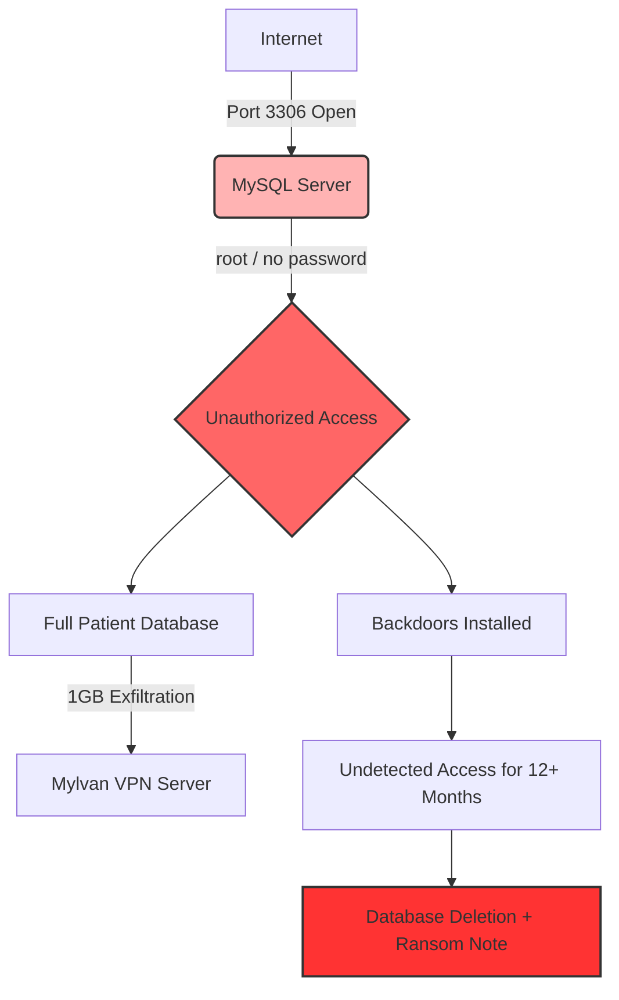

# Vastaamo Breach — Incident Post-Mortem Report  
### A Technical Case Study by Satu Ikola

---

## 1. Executive Summary

The Vastaamo breach (2017–2020) is one of the most severe cybersecurity incidents in Finnish history.  
A forgotten and exposed database port, weak credentials, missing monitoring, and unencrypted psychotherapy records allowed attackers to exfiltrate and later publicly leak data of **33,000 patients**.

The breach resulted in:

- The company’s **bankruptcy (2021)**
- The CEO’s conviction for privacy violations
- Over **20,000 criminal reports** from victims
- A **6-year 3-month** prison sentence for the main attacker (2024)

This repository analyzes the incident from a SOC / Blue Team perspective, maps key actions to MITRE ATT&CK, and highlights both failures and actionable defensive measures.

---

## 2. Timeline of Events

### 2017-11 — Port 3306 opened
A MySQL database port (3306) containing psychotherapy records is opened to the internet for maintenance and never closed.  
It remains exposed for **around 16 months**.

### 2017-12 — First unauthorized access
Attacker gains access using weak credentials:
- `username: vastaamo`
- `password: zuukka66`
- `root` account with **no password**

### 2018-11 — 1 GB patient database exfiltrated
Around 1 GB of patient records is transferred to an external VPN provider.  
Due to lack of monitoring and logging, this goes completely unnoticed.

### 2019-03-13 — Port 3306 finally closed
The open port is discovered and closed after more than a year.

### 2019-03-15 — Database destroyed and ransom note
Two days after the port is closed, the patient database is wiped and a ransom note is left demanding payment in cryptocurrency.

### 2020-09-28 — Blackmail messages sent
The CEO and IT staff receive extortion messages indicating that patient records and personal identifiers will be sold and leaked.

### 2020-10-23 — Full database leaked
The full psychotherapy database is published on the dark web.  
Individual patients also begin receiving blackmail messages directly.

### 2023-02 — Main attacker arrested in France
The suspect is arrested based on digital traces left during the data publication.

### 2024-04 — Attacker sentenced
The attacker is sentenced to **6 years and 3 months** in prison for aggravated data breach, extortion, and related crimes.

---

## 3. Root Cause Analysis (RCA)

### Security Misconfiguration
- MySQL port 3306 exposed directly to the internet
- Firewall misconfigured to effectively allow all traffic
- `root` account without a password

### Weak Access Control
- Weak, guessable credentials
- No multi-factor authentication
- Poor privileged account hygiene and management

### Lack of Logging and Monitoring
- 1 GB data exfiltration not detected
- No SIEM or alerting in place
- No anomaly or behavior analytics on database access

### Unencrypted Sensitive Data
- Psychotherapy notes stored in plaintext
- Direct violation of GDPR requirements for protection and minimisation of sensitive personal data

### Governance and Process Failures
- No clear owner for cybersecurity
- No proper change management for exposing critical services
- No tested incident response plan
- Risk management treated as non-critical for business

---

## 4. MITRE ATT&CK Mapping

See more details in [`mitre/mitre-mapping.md`](mitre/mitre-mapping.md).

| Attack Phase        | Technique ID | Technique Name                          |
|---------------------|-------------|-----------------------------------------|
| Initial Access      | T1190       | Exploit Public-Facing Application       |
| Credential Access   | T1110       | Brute Force / Credential Guessing       |
| Privilege Escalation| T1068       | Exploitation for Privilege Escalation   |
| Defense Evasion     | T1070       | Log Deletion / Lack of Logging          |
| Collection          | T1005       | Data from Local System                  |
| Exfiltration        | T1041       | Exfiltration Over C2 Channel            |
| Impact              | T1486       | Data Encrypted / Destroyed for Impact   |

---

## 5. Attack Path Diagram



More diagrams are available in the [`diagrams/`](diagrams) folder.

---

## 6. What Went Wrong (Defensive Failures)

### 1. No SIEM or central monitoring
- No alerts for abnormal data volume from the database
- No detection of anomalous login locations or times
- No correlation of events over a long dwell time

### 2. No encryption of psychotherapy records
- Highly sensitive mental health data stored in plaintext
- Directly linkable to identifiable individuals

### 3. Poor identity and access management
- Passwordless `root` account on a production database
- Weak user password (`zuukka66`)
- No enforced password policies or rotation

### 4. No formal risk management
- Critical production system left exposed for over a year
- No systematic review of exposed services

### 5. No change management
- Port opened “temporarily” and never closed
- No tracked change request or rollback plan

---

## 7. Recommended Controls

### Technical Controls
- Close all unnecessary ports; never expose databases directly to the internet
- Enforce strong password policies and multi-factor authentication
- Encrypt all sensitive data at rest and in transit
- Deploy a SIEM (e.g., Microsoft Sentinel) and enable alerting for:
  - Unusual data access patterns
  - Mass downloads from databases
  - Logins from unusual locations or IP ranges
- Apply network segmentation and the principle of least privilege
- Regularly patch and harden database services and firewalls

### Organisational Controls
- Assign clear ownership for cybersecurity and data protection
- Implement and test incident response and disaster recovery plans
- Establish proper change management procedures
- Perform regular risk assessments and GDPR compliance reviews
- Provide ongoing security awareness training for staff and management

---

## 8. Lessons Learned (Blue Team Perspective)

Modern SOC tooling could have significantly reduced the impact:

- **Microsoft Sentinel** could have detected:
  - Mass data exfiltration from the database
  - Anomalous login behaviour from foreign IP ranges
  - Repeated access patterns indicative of long-term intrusion

- **Microsoft Defender XDR** could have:
  - Flagged passwordless administrative accounts
  - Alerted on suspicious processes and backdoor tooling
  - Helped correlate signals from endpoints, identities and network

The Vastaamo breach is a clear reminder that:
> Basic cyber hygiene, monitoring, and governance are often enough to prevent catastrophic incidents.

---

## 9. Business Impact

- **Bankruptcy (2021)** of the company
- **Conviction of the CEO** for privacy-related offences
- **Administrative fine** under GDPR
- Long-term reputational damage
- Thousands of individuals affected by identity theft risks and exposure of deeply personal psychotherapy notes

---

## 10. Repository Structure

```text
vastaamo-incident-postmortem/
├── README.md
├── diagrams/
│   ├── attack-path.md
│   ├── timeline.md
│   └── dwell-time.md
├── mitre/
│   └── mitre-mapping.md
├── lessons-learned/
│   └── defensive-controls.md
├── assets/
│   ├── banner_placeholder.png
│   └── diagram_placeholder.png
└── docs/
    └── index.html
```

---

## 11. Sources

This case study is based on public reporting, legal documents, and educational material used in a cybersecurity course.  
The focus of this repository is on **technical and organisational lessons learned** for SOC and Blue Team work.
