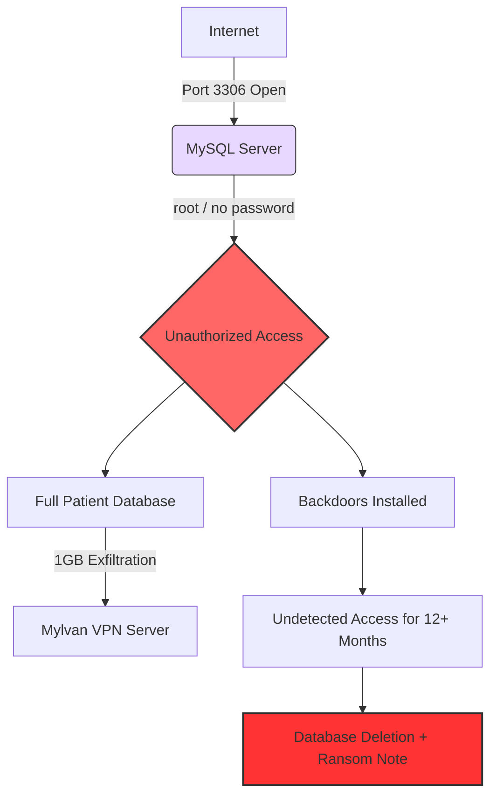

**🌐 Languages:**  
🇬🇧 English | 🇫🇮 [Suomi](README.fi.md)

## 📘 Table of Contents

1. [Executive Summary](#1-executive-summary)  
2. [Timeline of Events](#2-timeline-of-events)  
3. [Root Cause Analysis (RCA)](#3-root-cause-analysis-rca)  
4. [MITRE ATTCK Mapping](#4-mitre-attck-mapping)  
5. [Attack Path Diagram](#5-attack-path-diagram)  
6. [Defensive Failures](#6-defensive-failures)  
7. [Recommended Technical Controls](#7-recommended-technical-controls)  
8. [SOC & Blue Team Lessons Learned](#8-soc--blue-team-lessons-learned)  
9. [Business Impact](#9-business-impact)  
10. [Current Status (2025–2026)](#10-current-status-20252026)  
11. [Contact](#11-contact)  

# Vastaamo Data Breach — Incident Post-Mortem Report  
### Technical Case Study — Satu Ikola  
*(Updated to reflect legal and investigative developments through 2026)*

---

## 📝 Vastaamo Case Summary

  

  🇫🇮 <a href="README.fi.md">Read in Finnish</a>
  &nbsp;•&nbsp;
  🇬🇧 <a href="README.md">Read in English</a>

---

## **1. Executive Summary**

The Vastaamo breach (2017–2020) is one of the most severe privacy incidents in Finland’s history.  
A publicly exposed MySQL database, passwordless administrative accounts, lack of monitoring, and unencrypted psychotherapy notes enabled attackers to access, exfiltrate, and eventually leak sensitive data of **over 33,000 patients**.

**Key outcomes:**
- Company bankruptcy (2021)
- €608,000 GDPR administrative fine
- Direct extortion attempts targeting patients
- Former CEO data protection crime charge: district court conviction was overturned by the Court of Appeal (2025)
- Helsinki Court of Appeal sentenced Aleksanteri Kivimäki (26 Feb 2026) to 6 years and 11 months of imprisonment (not legally final)

This report analyzes the breach from a SOC / Blue Team perspective, provides a MITRE ATT&CK mapping, highlights defensive failures, and documents current legal developments.

---

## **2. Timeline of Events**

### **2017-11 — Port 3306 opened**
MySQL database port opened for maintenance and left exposed for **~16 months**.

### **2017-12 — First unauthorized login**
Attacker gains access using weak credentials:
- `username: vastaamo`
- `password: zuukka66`
- `root` account had **no password**

### **2018-11 — 1GB data exfiltrated**
~1GB of patient data transferred to an external VPN.  
Due to missing logging, the event was never detected.

### **2019-03-13 — Port closed**
After 16 months of exposure, the database port is finally closed.

### **2019-03-15 — Ransom attack**
Two days later, the database is wiped and a ransom note appears demanding cryptocurrency.

### **2020-09–10 — Blackmail & leak**
- Management receives new extortion messages  
- Full database is published on the dark web  
- Individual patients are directly targeted and blackmailed  

### 2024-04 - District Court sentence
Länsi-Uusimaa District Court sentenced Aleksanteri Kivimäki to 6 years and 3 months of imprisonment.

### 2025-09 - Released to await the Court of Appeal judgment
Kivimäki was released from pre-trial detention to await the Court of Appeal decision.

### 2026-02-26 - Court of Appeal judgment
Helsinki Court of Appeal increased the sentence to 6 years and 11 months.
The judgment is not legally final, and leave to appeal to the Supreme Court may be sought.

---

## **3. Root Cause Analysis (RCA)**

### **Security Misconfiguration**
- MySQL port 3306 publicly exposed  
- No firewall restrictions  
- Passwordless `root` account  

### **Weak Access Control**
- Weak static passwords  
- No MFA  
- Poor privileged account management  

### **Lack of Logging & Monitoring**
- 1GB exfiltration undetected  
- No SIEM correlation  
- No outbound anomaly detection  
- No alerts for unusual SQL activity  

### **Unencrypted Sensitive Data**
- Psychotherapy notes stored in plaintext  
- Clear GDPR violation  

### **Governance Failures**
- No clear cybersecurity ownership  
- No change management  
- No incident response plan  
- No risk assessments proportional to data sensitivity  

---

## **4. MITRE ATT&CK Mapping**

| Attack Phase        | Technique ID | Technique Name                          |
|---------------------|-------------|-----------------------------------------|
| Initial Access      | T1190       | Exploit Public-Facing Application       |
| Credential Access   | T1110       | Brute Force / Credential Guessing       |
| Privilege Escalation| T1068       | Exploitation for Privilege Escalation   |
| Defense Evasion     | T1070       | Log Deletion / Lack of Logging          |
| Collection          | T1005       | Data from Local System                  |
| Exfiltration        | T1041       | Exfiltration Over C2 Channel            |
| Impact              | T1486       | Data Encrypted / Destroyed for Impact   |

---

## **5. Attack Path Diagram**

---

## **6. Defensive Failures**

### **1. No SIEM or security monitoring**
- No anomaly detection  
- No mass-download alerts  
- No long-term intrusion detection  

### **2. No encryption**
Sensitive psychotherapy records were stored in plaintext → severe GDPR breach.

### **3. Identity & Access Management failures**
- Passwordless administrator account  
- Weak static passwords  
- No MFA  

### **4. Lack of risk management**
A critical production database was exposed to the internet for over a year without detection.

### **5. Poor change management**
Port 3306 was opened for maintenance and forgotten.  
No documentation, no ownership, no review process.

---

## **7. Recommended Technical Controls**

- Do not expose databases directly to the internet  
- Enforce MFA and strong password policies  
- Encrypt all sensitive data (at rest + in transit)  
- Deploy SIEM such as Microsoft Sentinel to detect:
  - Unusual SQL queries  
  - Large outbound transfers  
  - Impossible travel logins  
- Implement network segmentation  
- Apply least privilege principles across systems  

---

## **8. SOC & Blue Team Lessons Learned**

### **Microsoft Sentinel would have detected:**
- Large-scale outbound data exfiltration  
- Anomalous SQL query patterns  
- Logins from unusual geographic locations  
- Persistence or lateral movement activity  

### **Defender XDR would have surfaced:**
- Passwordless admin accounts  
- Suspicious backdoor processes  
- Multi-signal correlation across identity, network, and endpoint  

> **Key lesson:** Most catastrophic breaches are preventable with basic security hygiene: secure configuration, IAM discipline, monitoring, and governance.

---

## **9. Business Impact**

- Bankruptcy (2021)
- €608,000 GDPR administrative fine
- Former CEO data protection crime charge: district court conviction was overturned by the Court of Appeal (2025)
- Over 33,000 victims were exposed to identity theft and severe privacy risks
- Long-term reputational and trust damage

---

## 10. Current status (2025-2026)

### Key recent developments

- Helsinki Court of Appeal sentenced Aleksanteri Kivimäki to 6 years and 11 months of imprisonment for the Vastaamo data breach and extortion. The judgment is not legally final, and leave to appeal to the Supreme Court may be sought.
- The Court of Appeal considered the statutory maximum (7 years) as the baseline, but reduced the sentence due to settlement agreements.
- According to the Court of Appeal, settlement agreements have been made or are being made with around 6,000 victims. In addition, around 2,000 compensation claims have been filed with the district court.
- Kivimäki was released from pre-trial detention in September 2025 to await the Court of Appeal judgment.

_Source: Yle 26 Feb 2026, https://yle.fi/a/74-20211792. Updated: 26 Feb 2026_

---

## **11. Contact**

**Satu Ikola**  
GitHub: https://github.com/SatuIkola  
LinkedIn: https://www.linkedin.com/in/satu-ikola

---

