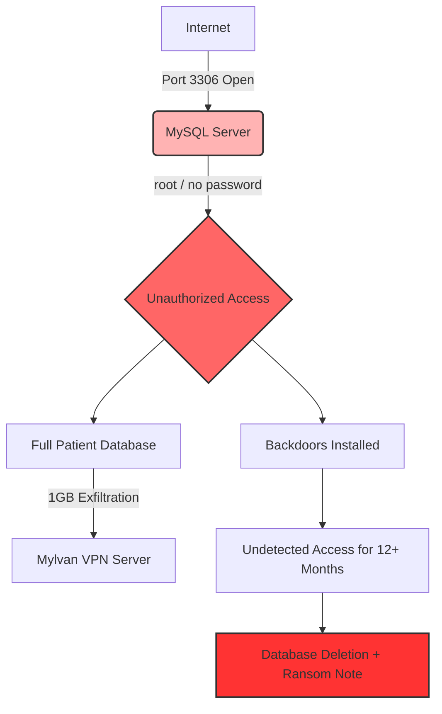

# Vastaamo Breach — Incident Post-Mortem Report  
### A Technical Case Study by Satu Ikola

---

### **Topics:**  
MySQL · Incident Response · Blue Team · SOC · Microsoft Sentinel · Microsoft Defender XDR · MITRE ATT&CK · Data Exfiltration · Threat Hunting · GDPR · Ransomware · Cybersecurity Governance

---
---

## 📘 Table of Contents

- [1. Executive Summary](#1-executive-summary)
- [2. Timeline of Events](#2-timeline-of-events)
- [3. Root Cause Analysis (RCA)](#3-root-cause-analysis-rca)
- [4. MITRE ATTCK-Mapping](#4-mitre-attck-mapping)
- [5. Attack Path Diagram](#5-attack-path-diagram)
- [6. What Went Wrong (Defensive Failures)](#6-what-went-wrong-defensive-failures)
- [7. Recommended Controls (Technical)](#7-recommended-controls-technical)
- [8. Lessons Learned (Blue-Team--soc)](#8-lessons-learned-blue-team--soc)
- [9. Business Impact](#9-business-impact)
- [10. Contact](#10-contact)

---

## 1. Executive Summary

The Vastaamo breach (2017–2020) is one of the most severe cybersecurity incidents in Finnish history.  
A forgotten and publicly exposed database port, passwordless accounts, missing monitoring, and unencrypted psychotherapy records allowed attackers to exfiltrate and eventually leak data of **33,000 patients**.

The breach resulted in:

- The company’s **bankruptcy (2021)**
- The CEO’s conviction for privacy violations
- Over **20,000 criminal reports** from victims
- A **6-year 3-month** prison sentence for the attacker (2024)

This report analyzes the incident from a SOC / Blue Team perspective, mapping the actions to MITRE ATT&CK and highlighting defensive failures and actionable lessons.

---

## 2. Timeline of Events

### **2017-11 — Port 3306 opened**
MySQL database port opened for maintenance and left exposed for **16 months**.

### **2017-12 — First unauthorized access**
Attacker gains access using weak credentials:
- `username: vastaamo`
- `password: zuukka66`
- `root` account with **no password**

### **2018-11 — 1 GB patient database exfiltrated**
Approximately 1GB of psychotherapy records is transferred to an external VPN.  
Due to lack of logging or monitoring, this remains undetected.

### **2019-03-13 — Port closed**
After 16 months of exposure, the port is finally shut.

### **2019-03-15 — Ransom attack**
Two days later the database is wiped and a ransom message left demanding cryptocurrency.

### **2020-09–10 — Blackmail & leak**
- CEO and IT staff receive extortion messages  
- The full patient database is published on the dark web  
- Individual victims are directly blackmailed

### **2023–2024 — Arrest & sentencing**
Attacker arrested (2023) and sentenced (2024) to 6 years 3 months.

---

## 3. Root Cause Analysis (RCA)

### **Security Misconfiguration**
- MySQL port 3306 exposed publicly  
- Firewall allowed unrestricted access  
- `root` account had **no password**

### **Weak Access Control**
- Static, guessable passwords  
- No MFA  
- Poor privileged account management

### **Lack of Logging & Monitoring**
- 1GB data exfiltration undetected  
- No SIEM correlation  
- No outbound traffic anomaly detection  
- No alerting on unusual database activity

### **Unencrypted Sensitive Data**
- Psychotherapy notes stored in plaintext  
- Direct GDPR violation

### **Governance Failures**
- No single owner for cybersecurity  
- No change management (port opened & forgotten)  
- No incident response plan  
- Minimal risk management despite sensitive data

---

## 4. MITRE ATT&CK Mapping

| Attack Phase        | Technique ID | Technique Name                          |
|---------------------|-------------|-----------------------------------------|
| Initial Access      | T1190       | Exploit Public-Facing Application       |
| Credential Access   | T1110       | Brute Force / Credential Guessing       |
| Privilege Escalation| T1068       | Exploitation for Privilege Escalation   |
| Defense Evasion     | T1070       | Log Deletion / Lack of Logging          |
| Collection          | T1005       | Data from Local System                  |
| Exfiltration        | T1041       | Exfiltration Over C2 Channel            |
| Impact              | T1486       | Data Encrypted / Destroyed for Impact   |

---

## 5. Attack Path Diagram

More diagrams are available in the [`diagrams/`](diagrams) folder.

---

## 6. What Went Wrong (Defensive Failures)

### **1. No SIEM or monitoring**
- No outbound anomaly detection  
- No detection of mass downloads  
- No indicator correlation  
- No long-term intrusion detection

### **2. No encryption**
Psychotherapy notes stored in plaintext → directly linkable to victims.

### **3. Identity and access management failures**
- Passwordless `root` account  
- Weak static passwords  
- No MFA

### **4. No risk management**
Critical production services left exposed for over a year.

### **5. No change management**
Port opened for maintenance and forgotten.

---

## 7. Recommended Controls (Technical)

- Close unnecessary ports; never expose databases publicly  
- Enforce MFA and strong password policies  
- Encrypt all sensitive data at rest and in transit  
- Deploy Microsoft Sentinel or similar SIEM  
- Enable alerts for:
  - Unusual SQL queries  
  - Large outbound transfers  
  - Impossible travel logins  
- Apply network segmentation  
- Implement least privilege access

---

## 8. Lessons Learned (Blue Team / SOC)

### **Microsoft Sentinel would have detected:**
- Mass data exfiltration  
- Anomalous query patterns  
- Foreign IP logins  
- Lateral movement / persistence  

### **Defender XDR would have surfaced:**
- Passwordless admin accounts  
- Suspicious processes/backdoors  
- Cross-domain correlation (identity + network + endpoint)

**Key learning:**  
> Most catastrophic breaches are preventable with basic monitoring, governance, and secure configuration.

---

## 9. Business Impact

- **Bankruptcy (2021)**  
- **CEO convicted (2023)**  
- **608 000€ GDPR fine**  
- Long-term reputational and financial damage  
- 33,000+ victims exposed to severe privacy harm  

---

## 10. Current Status (2025–2026) — Latest Developments in the Vastaamo Case

This section summarizes the most recent developments in the Vastaamo data breach case as of late 2025 and early 2026, including legal proceedings, new suspects, compensation issues, and ongoing investigative angles.

---

### 🔎 Key New Developments

| Topic | Description |
|-------|-------------|
| **New suspect: Patrick Newhard (USA)** | U.S. citizen Patrick Newhard has been charged with sending extortion emails related to the Vastaamo breach. He was extradited from Estonia to the United States and is suspected of assisting in aggravated extortion. |
| **Kivimäki released from custody (Autumn 2025)** | Aleksanteri Kivimäki was released from detention in September 2025 pending the Court of Appeal’s final ruling. The District Court’s sentence of **6 years and 3 months** remains in force during the appeal. |
| **Court of Appeal hearings concluded in late 2025** | The Helsinki Court of Appeal held its main hearings from 19 August to 26 November 2025. The final ruling will be issued **by 28 February 2026**. |
| **Compensation process ongoing** | The Finnish State Treasury continues to process victim compensation claims. Several victim groups and law firms argue that the compensation levels do not adequately reflect the severity of the harm. |
| **Potential broader criminal network** | The emergence of new suspects (e.g., Newhard) indicates that multiple individuals may have been involved in the extortion phase of the crime. Investigations continue internationally. |
| **Vastaamo GDPR fine remains in effect** | The psychotherapy center’s administrative fine of **€608,000** was upheld due to severe data protection failures, insufficient logging, and security misconfigurations. |

---

### 🧭 Summary: What Is Final — What Remains Open

#### ✔ Resolved
- District Court sentence: **6 years 3 months imprisonment** (Kivimäki)  
- **€608,000 GDPR fine** imposed on Vastaamo  
- Confirmation of widespread leakage of psychotherapy records  
- Considered the most severe privacy breach in Finland’s history

#### ⏳ Pending / Ongoing
- **Court of Appeal’s final decision by 28 February 2026**  
- Possible additional suspects and charges related to extortion or assistance  
- Assessment of the adequacy and scope of victim compensation  
- Investigation into potential international collaborators  

---

### 🌐 Sources

- Bitdefender — *US citizen charged in Vastaamo extortion case*  
  https://www.bitdefender.com/en-us/blog/hotforsecurity/vastaamo-psychotherapy-hack-us-citizen-charged-in-latest-twist-of-notorious-data-breach

- Databreaches.net — *Kivimäki walks free during appeal*  
  https://databreaches.net/2025/09/11/kivimaki-walks-free-during-appeal-over-vastaamo-data-breach

- Helsinki Court of Appeal — *Hearings concluded, ruling expected by 28 February 2026*  
  https://tuomioistuimet.fi/hovioikeudet/helsinginhovioikeus/fi/index/tiedotteet/2025/paakasittelyvastaamo-asiassaalkaaelokuussa2025r241302.html

- State Treasury of Finland — *Victims of the Vastaamo data breach*  
  https://www.valtiokonttori.fi/en/services/services-related-to-compensation-and-accidents/vastaamo

- EDPB — *GDPR sanction imposed on Vastaamo*  
  https://www.edpb.europa.eu/news/national-news/2022/administrative-fine-imposed-psychotherapy-centre-vastaamo-data-protection_en

- Have I Been Pwned — *Leaked data overview*  
  https://haveibeenpwned.com/Breach/Vastaamo

---

### 📌 Short Summary

The Vastaamo case remains an active and evolving cybercrime and legal matter.  
The **Court of Appeal’s ruling in February 2026** is expected to determine the final legal responsibility and sentencing. At the same time, compensation processes, new suspects, and ongoing investigative developments keep the case relevant both legally and in the cybersecurity community.

---

## 11. Contact

**Satu Ikola**  
GitHub: https://github.com/SatuIkola  
LinkedIn: https://www.linkedin.com/in/satu-ikola

---

